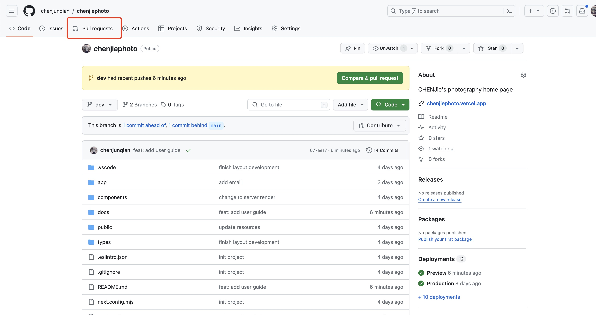
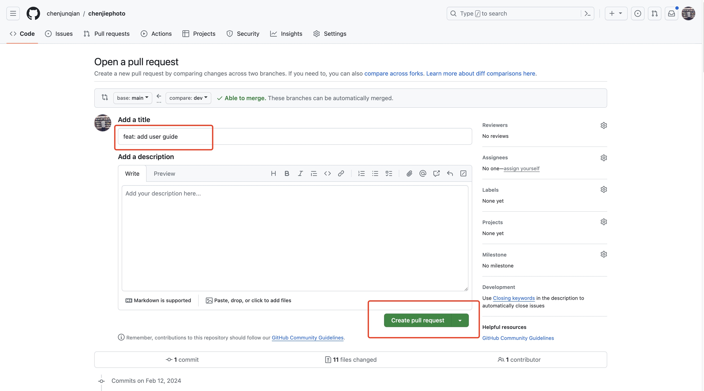

# 如何更新网站内容

## 图床

这里以 [imgbb](https://imgbb.com/) 为图床为例子（可以自己注册一个账号）， 上传图片后，获取到图片的链接。

上传图片完成后，点击下图的按钮(红色标记)


点击后会出现弹窗


选择HTML image


红色方框内的链接就可以用于网站图片展示


## 用图床的链接来更新网站图片

在项目页面<https://github.com/chenjunqian/chenjiephoto>，首先点击分支按钮，如下图为`main`, 在点击`dev`，我们要先切换到开发分支，再更新内容


网站的数据定义在`public`文件夹下


在`public`文件夹下，有`home`， `aboutme`和`project-resource`， 分别对应主页，关于我和项目详情三个页面


在每个文件夹下会有个`project_detail.json`文件，用于定义网页上显示的内容，下图为主页内容定义的实例，`project`字段表示主页展示的项目，例如第一个为**Toxic Colors**，`id` `toxic-colors`对应的为项目页面的链接，比如项目**Toxic Colors**的链接为<https://chenjiephoto.vercel.app/project/toxic-colors>，同时也是对应`project-resources`文件夹下项目详情对应的文件，`title`为项目标题，`description`为项目描述，`imageUrl`为项目图片，图片的链接就是上面上传到图床后，获取的链接（其他的任何`imageUrl`字段同理）。


对比网站首页显示的内容


对应的`id`，如下图，`toxic-colors` 对应`project-resources`文件夹的内容定义文件位置，如有新的项目，可以创建新的`json`文件，例如有新的摄影作品叫新世界 New World，这时就可以在`home`文件下的`project_detail.json` 中的`projects`后追加一个

```json
{
    "id": "new-world",
    "title": "New World",
    "description": "New world example description",
    "imageUrl": "https://i.ibb.co/T47kFfM/5-1.jpg"
}
```

同时在`project-resource`文件夹下，创建一个文件夹名为`new-world`，和`project_detail.json`文件（内容结构和其他`project-reousrces`下的一致），`title`为项目标题，`description`为项目描述，`imageItems`为图片列表。


对比项目具体详情页面


对于其他页面也是一样

## 部署网站

更新好内容后，点击`Pull request`按钮



在点击 `New pull request` 按钮


选择从`dev`分支更新到`main`分支


填写title，然后点击`Create pull request`按钮



等待所有检查标记为绿色后，再点击`Merge pull request`按钮


再点击`Confirm merge`


这时，再等待大概1分钟，刷新<https://chenjiephoto.vercel.app/> 就可以看到更新的内容了。
